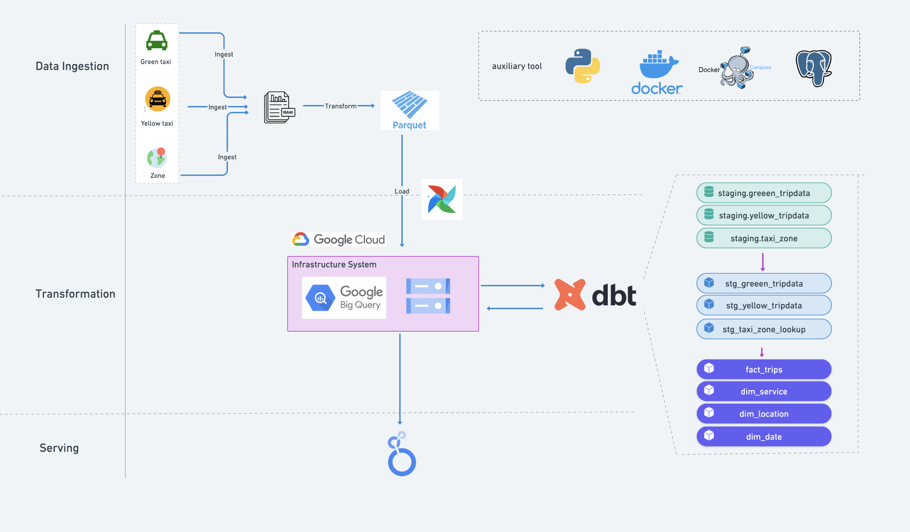
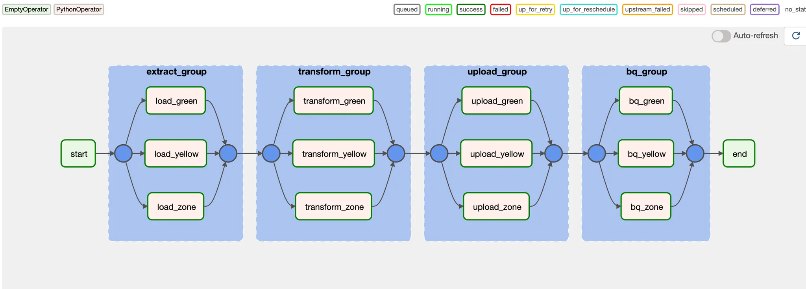
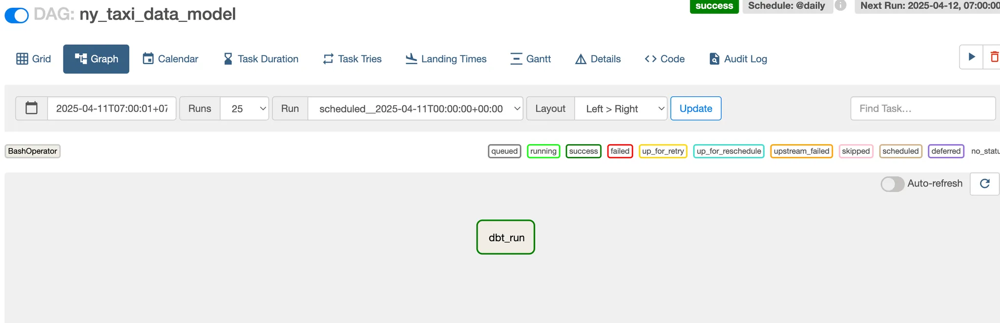
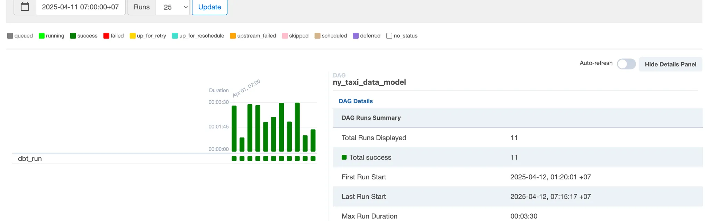
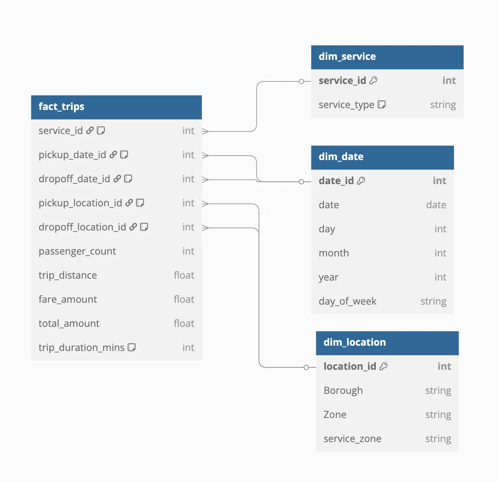
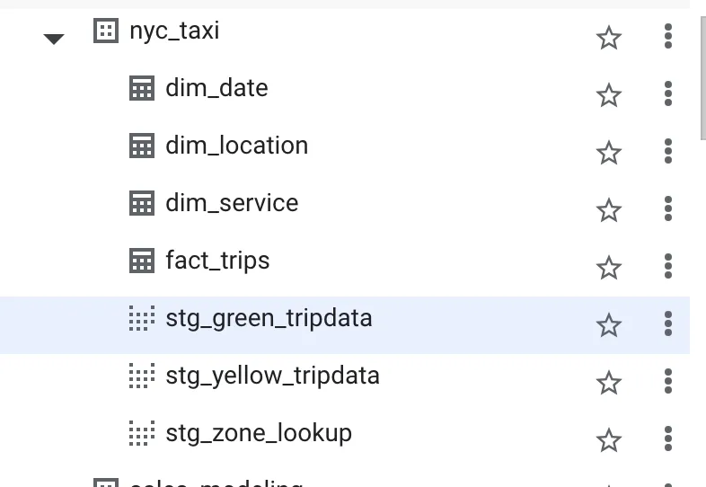

## 🚖 Project Overview

This project builds an automated data pipeline for NYC taxi trip data using an ETL (Extract, Transform, Load) workflow. The pipeline ingests raw data, transforms it, loads it into Google Cloud, models it with dbt, and orchestrates the process with Airflow, all containerized using Docker.

### Objectives

- Ingest Green Taxi, Yellow Taxi, and Taxi Zone Lookup datasets.
- Transform data using Python/Pandas.
- Load into GCS and BigQuery.
- Model data with dbt into staging, dimension, and fact tables.
- Schedule daily runs with Airflow, supporting backfills.
## Architecture 🏗️

The pipeline follows an ETL workflow:




## **Technology stack**

- **Apache Airflow**: Workflow orchestration.
- **Docker**: Containerization.
- **Google Cloud Storage (GCS)**: Data storage.
- **Google BigQuery**: Data warehouse.
- **dbt**: Data modeling.
- **Python/Pandas**: Data processing.
- **PostgreSQL**: Airflow metadata DB.
- **Parquet/CSV**: Data formats.

### Dataset Introduction

| Dataset | Description | Key Columns | Source |
| --- | --- | --- | --- |
| **Green Taxi Trip Data** | Green taxi trips | pickup_datetime, dropoff_datetime, pickup_location_id, dropoff_location_id, passenger_count, trip_distance, fare_amount, total_amount | [NYC TLC Green Taxi Data](https://www.nyc.gov/site/tlc/about/tlc-trip-record-data.page) |
| **Yellow Taxi Trip Data** | Yellow taxi trips | Similar to Green Taxi | [NYC TLC Yellow Taxi Data](https://www.nyc.gov/site/tlc/about/tlc-trip-record-data.page) |
| **Taxi Zone Lookup** | Maps location IDs to zones | location_id, Borough, Zone, service_zone | [NYC TLC Taxi Zone Lookup](https://www.nyc.gov/site/tlc/about/tlc-trip-record-data.page) |

Data is in Parquet/CSV format, using a January 2021 subset, but the pipeline is designed to scale for larger datasets.


## Setup and Dependencies ⚙️

### Docker Setup

- **ny_taxi**: PostgreSQL container for Airflow metadata DB, runs on port 5432.
- **apache_airflow**: Airflow container, built from dags/Dockerfile, runs on port 8080, mounts dags, output, dbt, secret_key, and modules.

### Dockerfile

- Base: apache/airflow:2.3.0-python3.8.
- Installs git, dbt-bigquery==1.5.7, and dependencies from requirements.txt.

### Dependencies

- Includes apache-airflow[postgres], pandas, pyarrow, google-cloud-storage, selenium, and others for Airflow, BigQuery, and data processing.


## Directory Structure 📁

```sql
PERSONAL_PROJECT/
├── .conda/
├── dags/
│   ├── **pycache**/
│   ├── dbt_airflow_dag.py
│   ├── dell_monitors_dag.py
│   ├── Dockerfile
│   ├── ny_taxi_dag.py
│   └── requirements.txt
├── dbt/
│   ├── dbt_packages/
│   ├── logs/
│   ├── macros/
│   │   └── calculate_distance.sql
│   ├── models/
│   │   ├── marts/
│   │   │   ├── dim_date.sql
│   │   │   ├── dim_location.sql
│   │   │   ├── dim_service.sql
│   │   │   └── fact_trips.sql
│   │   └── staging/
│   │       ├── stg_green_tripdata.sql
│   │       ├── stg_yellow_tripdata.sql
│   │       └── stg_zone_lookup.sql
│   └── secret/
├── target/
│   ├── .user.yml
│   ├── dbt_project.yml
│   ├── green_raw.parquet
│   ├── green_transformed.parquet
│   ├── yellow_raw.parquet
│   ├── yellow_transformed.parquet
│   ├── zone_raw.csv
│   └── zone_transformed.parquet
├── modules/
│   ├── **pycache**/
│   ├── configs/
│   ├── **init**.py
│   ├── [extract.py](http://extract.py/)
│   ├── load_to_bigquery.py
│   ├── [load.py](http://load.py/)
│   ├── [transform.py](http://transform.py/)
│   └── webserver_config.py
├── output/
├── .gitignore
└── docker-compose.yml
```


## Airflow Pipeline

The pipeline is orchestrated by Airflow using two DAGs: ny_taxi_dag.py for the ETL process and dbt_airflow_dag.py for dbt tasks. 








1. **Extract Group (extract_group)**
    - **Tasks**: load_green, load_yellow, load_zone.
    - **Description**: Downloads raw data for Green Taxi, Yellow Taxi, and Taxi Zone Lookup.
    - **Output**: green_raw.parquet, yellow_raw.parquet, zone_raw.csv in the output directory.
2. **Transform Group (transform_group)**
    - **Tasks**: transform_green, transform_yellow, transform_zone.
    - **Description**: Transforms raw data using Python/Pandas, standardizes formats, and filters invalid records.
    - **Output**: green_transformed.parquet, yellow_transformed.parquet, zone_transformed.parquet.
3. **Upload Group (upload_group)**
    - **Tasks**: upload_green, upload_yellow, upload_zone.
    - **Description**: Uploads transformed data to Google Cloud Storage (GCS).
    - **Output**: Data stored in GCS (e.g., gs://nyc-taxi-data/green/).
4. **BigQuery Group (bq_group)**
    - **Tasks**: bq_green, bq_yellow, bq_zone.
    - **Description**: Loads data from GCS into BigQuery tables for further processing.
    - **Output**: BigQuery tables: nyc_taxi.green_tripdata, nyc_taxi.yellow_tripdata, nyc_taxi.zone_tripdata.
5. **dbt Run**
    - **DAG**: dbt_airflow_dag.py.
    - **Task**: dbt_run.
    - **Description**: Runs dbt to transform data into staging, dimension, and fact tables.
    - **Output**:
        - Staging: stg_green_tripdata, stg_yellow_tripdata, stg_zone_lookup.
        - Dimension: dim_date, dim_service, dim_location.
        - Fact: fact_trips.


## Data Models with dbt 🗃️

dbt models in dbt/models, split into staging and marts.

### Data Model Schema 📊



### Staging Models

These models clean and standardize the raw data loaded into BigQuery.


### 1. stg_green_tripdata

- **Source**: nyc_taxi.green_tripdata table in BigQuery.
- **Purpose**: Standardizes Green Taxi data, adds a service_type column set to green, and filters out invalid records (e.g., null values).
- **Schema**:
    
    
    | Column Name | Type | Description |
    | --- | --- | --- |
    | pickup_datetime | INT64 | Pickup timestamp (Unix μs) |
    | dropoff_datetime | INT64 | Dropoff timestamp (Unix μs) |
    | pickup_location_id | INT64 | Pickup location ID |
    | dropoff_location_id | INT64 | Dropoff location ID |
    | passenger_count | INT64 | Number of passengers |
    | trip_distance | FLOAT64 | Trip distance (miles) |
    | fare_amount | FLOAT64 | Fare amount (USD) |
    | total_amount | FLOAT64 | Total amount (USD) |
    | service_type | STRING | Service type (green) |

### 2. stg_yellow_tripdata

- **Source**: nyc_taxi.yellow_tripdata table in BigQuery.
- **Purpose**: Standardizes Yellow Taxi data, adds a service_type column set to yellow, and filters out invalid records.
- **Schema**: Same as stg_green_tripdata, but with service_type set to yellow.

### 3. stg_zone_lookup

- **Source**: nyc_taxi.zone_tripdata table in BigQuery.
- **Purpose**: Standardizes Taxi Zone Lookup data and filters out invalid records.
- **Schema**:
    
    
    | Column Name | Type | Description |
    | --- | --- | --- |
    | location_id | INT64 | Location ID |
    | Borough | STRING | Borough name |
    | Zone | STRING | Zone name |
    | service_zone | STRING | Service zone category |

### Dimension Models (in marts/)

These models create dimension tables for the Star Schema.



### 1. dim_date

- **Purpose**: Contains date information for all dates from 2020-01-01 to 2025-12-31, generated using BigQuery's GENERATE_DATE_ARRAY.
- **Schema**:
    
    
    | Column Name | Type | Description |
    | --- | --- | --- |
    | date_id | INT64 | Unique date ID |
    | date | DATE | Date (e.g., 2025-04-01) |
    | day | INT64 | Day of month (1-31) |
    | month | INT64 | Month (1-12) |
    | year | INT64 | Year (e.g., 2025) |
    | day_of_week | STRING | Day of week (e.g., Monday) |

### 2. dim_service

- **Purpose**: Contains service types (green or yellow) with unique IDs for joining with the fact table.
- **Schema**:
    
    
    | Column Name | Type | Description |
    | --- | --- | --- |
    | service_id | INT64 | Unique service ID |
    | service_type | STRING | Service type (green or yellow) |

### 3. dim_location

- **Source**: stg_zone_lookup.
- **Purpose**: Contains location information for taxi zones, used for joining with pickup and dropoff locations in the fact table.
- **Schema**: Same as stg_zone_lookup.

### Fact Model (in marts/)

### 1. fact_trips

- **Source**: Combines stg_green_tripdata and stg_yellow_tripdata using UNION ALL.
- **Purpose**: Creates a fact table for trip analytics by joining with dimension tables (dim_service, dim_date, dim_location). Filters out invalid timestamps and calculates trip duration.
- **Schema**:
    
    
    | Column Name | Type | Description |
    | --- | --- | --- |
    | service_id | INT64 | Foreign key to dim_service |
    | pickup_date_id | INT64 | Foreign key to dim_date (pickup) |
    | dropoff_date_id | INT64 | Foreign key to dim_date (dropoff) |
    | pickup_location_id | INT64 | Foreign key to dim_location (pickup) |
    | dropoff_location_id | INT64 | Foreign key to dim_location (dropoff) |
    | passenger_count | INT64 | Number of passengers |
    | trip_distance | FLOAT64 | Trip distance (miles) |
    | fare_amount | FLOAT64 | Fare amount (USD) |
    | total_amount | FLOAT64 | Total amount (USD) |
    | trip_duration_mins | INT64 | Trip duration (minutes) |

### Macros

### 1. calculate_duration

```sql

    DATE_DIFF(
        TIMESTAMP_MICROS(CAST({{ end_time }} AS INT64)),
        TIMESTAMP_MICROS(CAST({{ start_time }} AS INT64)),
        MINUTE
    )

```

### Star Schema Design

- Fact Table: fact_trips with metrics and foreign keys.
- Dimension Tables: Denormalized (dim_service, dim_date, dim_location).
- BigQuery Optimization: Partitioned by pickup_date_id, clustered by service_id, pickup_location_id.

### Partitioning and Clustering in BigQuery

- Partitioning: On pickup_date_id.
- Clustering: On service_id, pickup_location_id.


## Performance Optimization ⚡

- **dbt Model Materialization**: Materialized as table, option for incremental updates on fact_trips.
- **BigQuery Cost Optimization**:
    - Partition Pruning: Reduces data scanned.
    - Clustering: Minimizes data scanning.
    - Materialized Views: Precompute aggregations.


## Sample Analytical Query 🔍

```sql
SELECT
    dl.Borough AS pickup_borough,
    dd.month,
    dd.year,
    SUM(ft.total_amount) AS total_revenue,
    AVG(ft.trip_duration_mins) AS avg_trip_duration
FROM
    {{ ref('fact_trips') }} ft
JOIN
    {{ ref('dim_location') }} dl
    ON ft.pickup_location_id = dl.location_id
JOIN
    {{ ref('dim_date') }} dd
    ON ft.pickup_date_id = dd.date_id
WHERE
    dd.year = 2025
GROUP BY
    dl.Borough,
    dd.month,
    dd.year
ORDER BY
    dd.month,
    total_revenue DESC;
```
